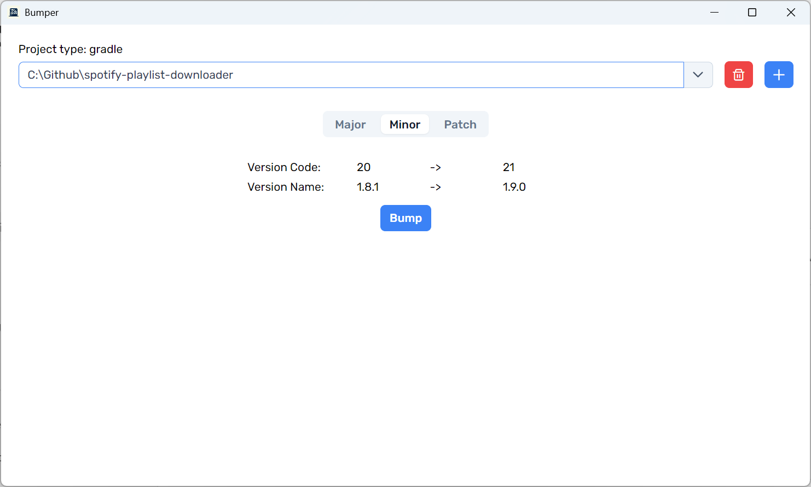

<div align="center">
    
    <h1>Bumper</h1>
</div>

Bumper is an Electron app that automates version bumping for Android and Node.js projects, ensuring consistent and hassle-free version management.

It automatically updates:
- `versionCode` and `versionName` in Android projects
- `version` in Node.js projects

After updating, Bumper creates a Git tag (e.g. `v1.0.0`), commits the changes with the same tag name, and pushes everything to the remote repository.



## Download

📥 Get the latest release from the [GitHub Releases page](https://github.com/supersu-man/bumper/releases)

## Development

Run the following commands simultaneously to start development:

```
npm run start
npm run electron-start
```
- Angular live reload works as expected.
- Electron code changes require a rebuild.

## Build

To build the Angular + Electron app using Electron Builder, run:

```
npm run electron-package
```
Run `npm run electron-package` to build Angular+Electron dist uing Electron Builder.

⚠️ Note: Don’t forget to update the appId in package.json to your appId.